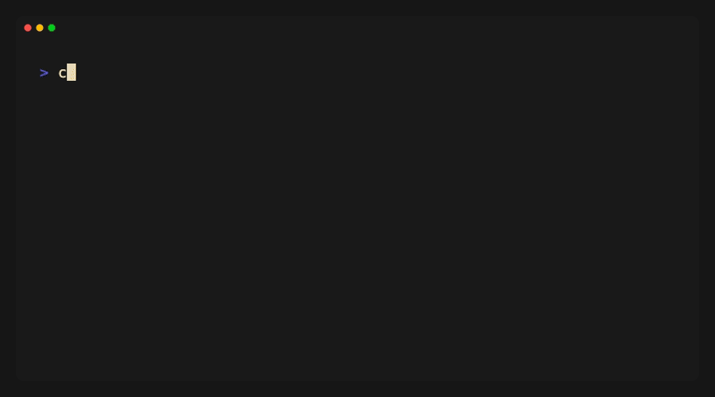

# 🥢 qo

<a href="https://terminaltrove.com/qo/">
  
</a>

[](https://github.com/kiki-ki/go-qo/actions/workflows/ci.yml)
[](https://github.com/kiki-ki/go-qo/blob/main/LICENSE)
[](https://goreportcard.com/report/github.com/kiki-ki/go-qo)


> **qo** [cue-oh] *noun.*
>
> 1. Abbreviation for **"Query & Out"**.
> 2. The peace of mind obtained by filtering data with SQL instead of complex syntax.

**qo** is a minimalist TUI that lets you query JSON, CSV, and TSV files using SQL.<br>
**"Query"** what you need, and get it **"Out"** to the pipeline.



## Why qo?

* **Muscle Memory**: Use the SQL syntax you've known for years.
* **Pipeline Native**: Reads from `stdin`, writes to `stdout`.
* **Interactive**: Don't guess the query. See the result, then hit Enter.

## Install

### Homebrew (macOS/Linux)

```bash
brew install kiki-ki/tap/qo
```

### Shell Script

```bash
curl -sfL https://raw.githubusercontent.com/kiki-ki/go-qo/main/install.sh | sh
```

### Go Install

```bash
go install github.com/kiki-ki/go-qo/cmd/qo@latest
```

## Usage

**qo** reads from both file arguments and standard input (stdin).

```bash
# Interactive mode (Open TUI)
cat x.json | qo
qo x.json y.json

# Non-interactive mode (Direct output)
cat x.json | qo -q "SELECT * FROM tmp WHERE id > 100"
qo -q "SELECT * FROM x JOIN y ON x.id = y.x_id" x.json y.json"
```

### Pipe-Friendly TUI

TUI mode works seamlessly with pipes. Explore data interactively, then pass the result to other tools.

```bash
# Fetch JSON API > Filter interactively with qo > Format with jq
curl -s https://api.github.com/repos/kiki-ki/go-qo/commits | qo | jq '.[].sha'

# Explore > Filter > Compress
cat large.json | qo | gzip > filtered.json.gz
```

### Query Logs & Aggregate

Use SQL to analyze structured data.

```bash
# Filter error logs
cat app.log | qo -q "SELECT timestamp, message FROM tmp WHERE level = 'error'"

# Aggregate sales by region
qo -i csv sales.csv -o csv -q "SELECT region, SUM(amount) FROM sales GROUP BY region"
```

### Convert Formats

Transform between various formats.

```bash
qo -o csv data.json -q "SELECT id, name FROM data"             # JSON → CSV
qo -i csv -o json users.csv -q "SELECT * FROM users"           # CSV → JSON
qo -o jsonl data.json -q "SELECT * FROM data"                  # JSON → JSON Lines
qo -i csv --no-header raw.csv -q "SELECT col1, col2 FROM raw"  # Headerless CSV
```

## Options

| Flag | Short | Default | Description |
| :--- | :--- | :--- | :--- |
| `--input` | `-i` | json | Input format: json, csv, tsv ("json" includes "jsonl") |
| `--output` | `-o` | json | Output format: json, jsonl, csv, tsv, table |
| `--query` | `-q` | | Run SQL query directly (Skip TUI) |
| `--no-header` | | | Treat first row as data, not header (CSV/TSV only) |

## UI Controls

| Key | Mode | Action |
| :--- | :--- | :--- |
| `Tab` | ALL | Switch between Query/Table mode |
| `Esc` / `Ctrl+C` | ALL | Quit (Output nothing) |
| `Enter` | QUERY | Output result to stdout and Exit |
| `↑` `↓` / `j` `k` | TABLE | Scroll rows |
| `←` `→` / `h` `l` | TABLE | Scroll columns |

## SQL Dialect

**qo** uses **SQLite** as its SQL engine. All queries follow SQLite syntax and support its built-in functions.

### Querying Nested JSON

Use SQLite's `json_extract()` function to access nested fields in JSON data.

```bash
# Sample data: [{"user": {"name": "Alice", "age": 30}}, {"user": {"name": "Bob", "age": 25}}]

# Extract nested fields
qo data.json -q "SELECT json_extract(user, '$.name') AS name FROM data"
# Filter by nested value
qo data.json -q "SELECT * FROM data WHERE json_extract(user, '$.age') > 25"
```

For more details, see [SQLite JSON Functions](https://www.sqlite.org/json1.html).

## Built With

| Category | Library |
| :--- | :--- |
| TUI Framework | [Bubble Tea](https://github.com/charmbracelet/bubbletea) |
| Styling | [Lip Gloss](https://github.com/charmbracelet/lipgloss) |
| CLI | [Cobra](https://github.com/spf13/cobra) |
| SQL Engine | [modernc.org/sqlite](https://pkg.go.dev/modernc.org/sqlite) (Pure Go, CGO-free) |

## License

MIT
